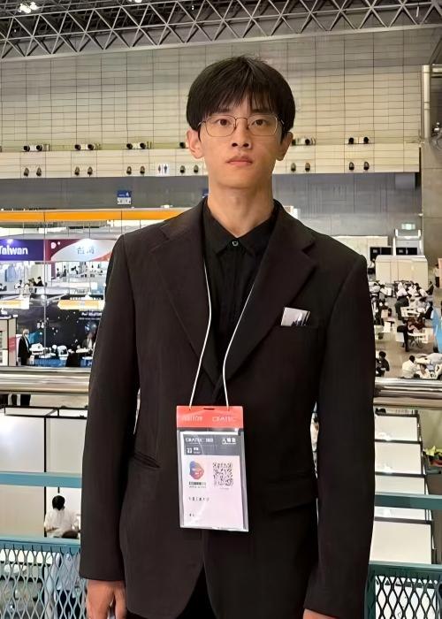

<!DOCTYPE html>
<html lang="zh-CN">
</head>
<body>
  

    <!-- 头部：照片 + 基本信息 -->
    <header>
      

        <!-- 个人照片 -->
        

        <!-- 基本文字信息 -->
        

          <h1 style="margin: 0;">李 纪堃</h1>
          
LI JIKUN

          

            男 ｜ 未婚 ｜ 出生年月：2001-03-11（24岁） 
            户籍：安徽省 ｜ 现住址：日本国千叶县船桥市 
            目前职业状态：应届生
          

          
简历更新日期：2025-07-04

        

      

    </header>

    <!-- 基本信息 -->
    <section class="section">
      <h2>基本信息</h2>
      

        
姓名：李 纪堃

        
拼音：LI JIKUN

        
性别：男

        
婚育状况：未婚

        
户籍：安徽省

        
现住址：日本国千叶县船桥市

      

    </section>

    <!-- 教育经历 -->
    <section class="section">
      <h2>教育经历</h2>

      

        <h3>千叶工业大学（日本）｜ 先进材料工学科｜硕士</h3>
        

          2024.04 – 2026.03 ｜ 再学中
        

        

          主修课程：材料电化学，能源材料，材料化学工艺工程学，材料物理学，固体物理学，磁性材料
        

      

      

        <h3>千叶工业大学｜新材料与应用技术｜本科</h3>
        

          2020.04 – 2024.03 ｜ 毕业
        

        

          主修课程：半导体材料，光机能材料，能源材料，材料电气化学，材料热化学，表面工学，磁性材料
        

      

      

        <h3>岡山朝日塾中等教育学校</h3>
        

          2017.09 – 2020.03 ｜ 毕业
        

      

    </section>

    <!-- 企业项目经历 -->
    <section class="section">
      <h2>企业项目经历</h2>

      

        <h3>灵动科技（北京）有限公司｜日本国际物流展参展人</h3>
        

          所属行业：机器人和自动化仓储物流 ｜ 公司性质：民营・非上市 ｜ 规模：300+ 人 
          入退社时间：2024.09 – 2024.10（0年1个月）
        

        自动化仓储
        移动机器人
        日语技术交流

        <ul class="list">
          <li>负责公司参加日本国际物流展（LTT EXPO 2024）的技术展示策划与执行，主导自动化仓储机器人动态演示设计，突出高效分拣、路径规划及多机协作优势。</li>
          <li>统筹遥控型叉车演示系统调试，解决信号延迟等技术问题，保证现场设备稳定运行。</li>
          <li>以日语进行设备性能讲解与技术交流，针对日本市场特点提出自动化仓储降本增效方案，并提出引入激光无线充电技术的建议，推动仓储系统智能化升级。</li>
          <li><b>成果：</b>成功展示自动化物流整体解决方案，现场解决遥控叉车信号延迟等关键问题；促成多项潜在合作意向，其中激光无线充电应用方案获得重点关注，为企业技术研发提供新方向；同时积累了面向日本市场的跨文化商务沟通经验。</li>
        </ul>
      

    </section>

    <!-- 学校项目经验 -->
    <section class="section">
      <h2>学校项目经验</h2>

      

        <h3>2024 日本国际半导体展览会（SEMICON Japan）｜光无线供电模型展示</h3>
        
2024.12 – 2024.12

        光无线供电
        Arduino
        3D打印
        <ul class="list">
          <li>作为核心研究人员，主导光无线供电技术的应用开发与原型展示。</li>
          <li>基于研究室自研太阳能电池，设计并集成潜水艇演示模型，直观验证该技术在深海应用环境下的潜力。</li>
          <li>负责 iCircuit 电路设计、Arduino 平台嵌入式开发及 SolidWorks 非标件设计，并通过 Thingiverse 进行3D打印与原型构建。</li>
          <li>面向百逾人次企业代表及高校师生，系统讲解技术原理、创新点与应用前景，回答深海适配性与安全性等关键问题。</li>
          <li>通过优化展示逻辑与互动设计，显著提升观众理解度与展台吸引力，有效促进技术传播并获得潜在合作意向。</li>
        </ul>
      

      

        <h3>第85届应用物理学会秋季学术演讲会（JSAP）｜水中光无线供电研究</h3>
        
2024.09 – 2024.09

        GaInP太阳能电池
        低温特性
        <ul class="list">
          <li>以水中环境下的光无线供电技术为研究对象，目标是减少水下探测设备对有线电缆或电池供电的依赖。</li>
          <li>以 GaInP 太阳电池为对象，分析其在深海低温环境中的光电转换特性。</li>
          <li>通过多波长激光照射实验，评估不同温度条件下的转换效率变化，发现特定波长在低温下具有更优转换效率。</li>
          <li>在研究过程中，系统掌握光伏材料实验设计、多变量测试方法及数据分析能力，为复杂环境下推广无线供电技术提供理论与实验基础。</li>
        </ul>
      

      

        <h3>第86届应用物理学会秋季学术演讲会（JSAP）｜水流对光传输效率的影响</h3>
        
2025.09 – 2025.09

        激光传输
        水流扰动
        <ul class="list">
          <li>针对水中光无线供电系统，评估水流对光传输效率的影响。</li>
          <li>采用波长为 532 nm 的激光，在水槽中设定不同流速（0～8 cm/s），对激光到达率进行测量分析。</li>
          <li>结果表明随流速增加，激光到达率约下降 3.9%，说明水分子散射对光传输具有显著影响。</li>
          <li>无论水流方向与光传播方向相同或相反，均呈现相似的下降规律，验证了水流扰动在光无线传输中的重要作用。</li>
        </ul>
      

      

        <h3>光无线能量传输项目（OWPT）｜长期研究</h3>
        
2024.04 – 至今

        OWPT
        多波长激光
        系统优化
        <ul class="list">
          <li>长期深耕光无线能量传输技术研究，专注于探索太阳能电池在复杂环境下的应用潜力。</li>
          <li>重点研究温度响应、光电转换效率及能量损失等关键特性，扩展太阳能电池新应用场景。</li>
          <li>通过系统实验分析多波长激光对太阳能电池光电性能的影响机制，并基于结果进行系统优化。</li>
          <li>核心成果包括：提升转换效率、澄清关键影响因素、推动部分技术应用落地，确立进一步研究方向，为光无线供电技术产业化提供基础数据与理论支撑。</li>
        </ul>
      

    </section>

    <!-- 毕业论文 -->
    <section class="section">
      <h2>毕业论文</h2>

      

        <h3>研究生毕业论文（预计）</h3>
        

          时间：2026年3月 
          题目：水环境条件对水下光无线供电性能的影响分析
        

        <ul class="li
